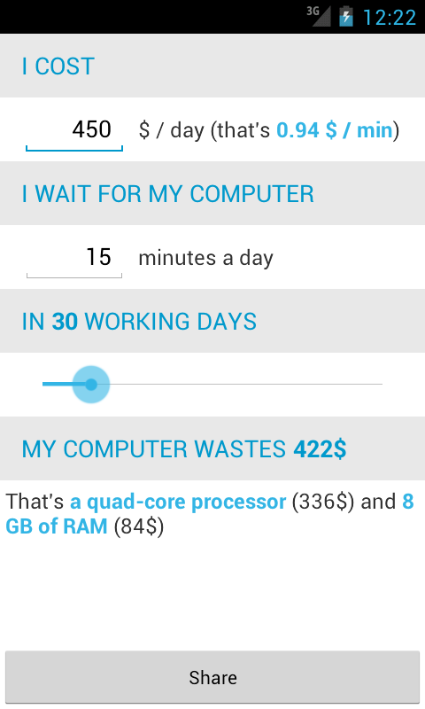

The Waste-o-meter is an Android application to compute the cost of waiting for your computer, and what material you could buy with this lost money.

It is available on the Android Market : https://play.google.com/store/apps/details?id=info.piwai.timeismoney

It should work and look identical on all Android versions, from 2.2 to 4.1. Please report any problem in the [issues](https://github.com/pyricau/waste-o-meter/issues).

Help is greatly appreciated! Have a look at `res/values/strings.xml` and `res/values/materials.xml`, I'm sure you can find improvements there. You can also provide translations!

This project was created by **Pierre-Yves Ricau** aka [Piwaï](http://piwai.info), and uses [AndroidAnnotations](http://androidannotations.org).

The idea comes from an [interesting article](http://thecodersbreakfast.net/index.php?post/2012/08/26/equipez-vos-d%C3%A9veloppeurs) by Olivier Croisier.

